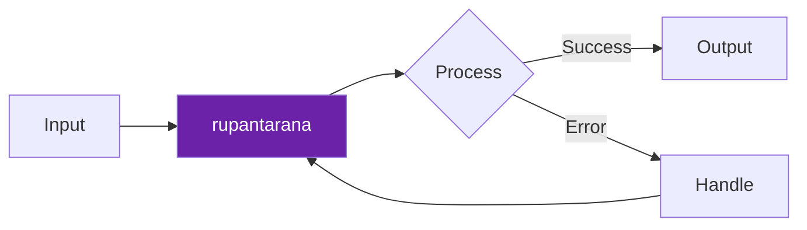

<div align="center">


# 🪷 रूपांतरण
## `rupantarana`

> *Bhagavata Purana — Dashavatara*

### Transformation of Form — avatar theory

**Format conversion for LLM agent data. Docx, PDF, HTML, Markdown, JSON converters.**

[](https://python.org)
[](https://github.com/darshjme/rupantarana)
[](https://github.com/darshjme/arsenal)
[](LICENSE)

*Formerly `agent-converter` — Part of the [**Vedic Arsenal**](https://github.com/darshjme/arsenal): 100 production-grade Python libraries for LLM agents, each named from the Vedas, Puranas, and Mahakavyas.*

</div>

---

## The Vedic Principle

The ancient *Rupantarana* principle from Bhagavata Purana — Dashavatara finds its modern expression in this library.

Just as the Vedic sages understood that every phenomenon in the universe follows deep patterns — patterns of creation, maintenance, and dissolution — `rupantarana` applies this wisdom to LLM agent engineering.

The concept of *रूपांतरण* (Transformation of Form — avatar theory) speaks directly to the technical problem this library solves. When the sages codified this principle in Bhagavata Purana — Dashavatara, they were describing not just a spiritual truth but a computational truth that would take humanity millennia to rediscover in silicon.

This is not coincidence. The universe has one nature. The Vedas described it first.

---

## How It Works



---

## Installation

```bash
pip install rupantarana
```

Or from source:
```bash
git clone https://github.com/darshjme/rupantarana.git
cd rupantarana && pip install -e .
```

## Quick Start

```python
from rupantarana import *

# See examples/ for full usage
```

---

## The Vedic Arsenal

`rupantarana` is one of 100 libraries in **[darshjme/arsenal](https://github.com/darshjme/arsenal)** — each named from sacred Indian literature:

| Sanskrit Name | Source | Technical Function |
|---|---|---|
| `rupantarana` | Bhagavata Purana — Dashavatara | Transformation of Form — avatar theory |

Each library solves one problem. Zero external dependencies. Pure Python 3.8+.

---

## Contributing

1. Fork the repo
2. Create feature branch (`git checkout -b fix/your-fix`)  
3. Add tests — zero dependencies only
4. Open a PR

---

<div align="center">

**🪷 Built by [Darshankumar Joshi](https://github.com/darshjme)** · [@thedarshanjoshi](https://twitter.com/thedarshanjoshi)

*"कर्मण्येवाधिकारस्ते मा फलेषु कदाचन"*
*Your right is to action alone, never to its fruits. — Bhagavad Gita 2.47*

[Vedic Arsenal](https://github.com/darshjme/arsenal) · [GitHub](https://github.com/darshjme) · [Twitter](https://twitter.com/thedarshanjoshi)

</div>
