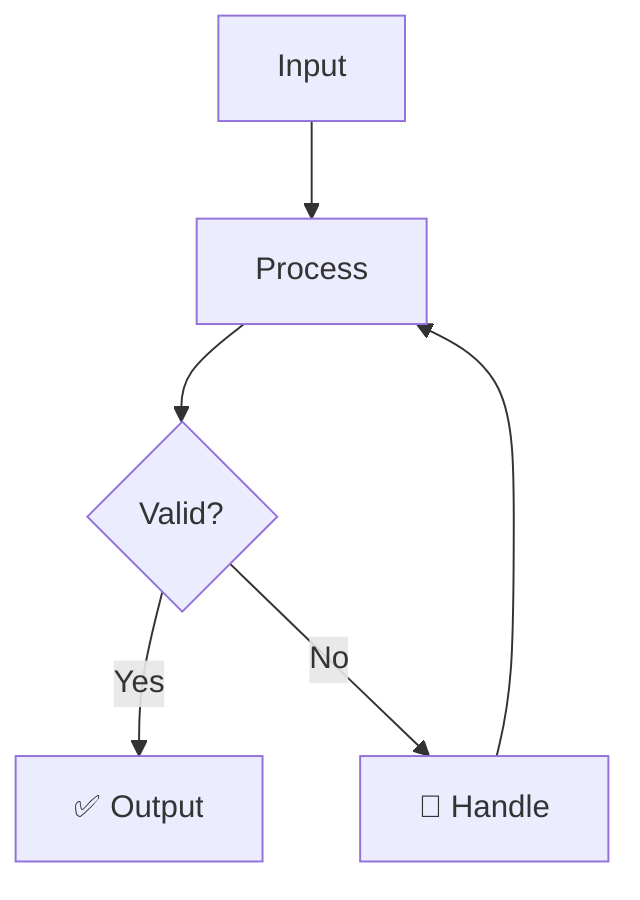

<div align="center">


# रूपांतरण
## rupantarana

> *Bhagavata Purana — Dashavatara*

**Transformation of Form — avatar theory**

_Format conversion for LLM agent data. Docx, PDF, HTML, Markdown, JSON converters._

[](https://python.org)
[](LICENSE)
[](https://github.com/darshjme/arsenal)
[](pyproject.toml)

</div>

---

## The Vedic Principle

The ancient seers who wrote the Bhagavata Purana — Dashavatara understood something that modern engineers are only beginning to rediscover: that the greatest technical systems mirror the eternal laws of cosmic order. Transformation of Form — avatar theory is not merely a Sanskrit translation — it is a fundamental principle woven into the fabric of existence itself.

In the Vedic worldview, rupantarana represents the transformation of form — avatar theory — the sacred function that every complex system requires to maintain dharmic operation. Just as the cosmos cannot function without this principle, your LLM agents cannot achieve production reliability without rupantarana. The ancient wisdom and modern engineering converge at this exact point.

rupantarana brings this timeless principle to your agent infrastructure. Whether you're building simple chatbots or complex multi-agent systems, converter is not optional — it is dharma. Built by engineers who understand both the technical requirements and the cosmic significance of getting this right.

---

## How It Works



---

## Quick Start

```bash
pip install rupantarana
```

```python
from rupantarana import *

# Initialize
agent = Rupantarana()

# Use
result = agent.process(your_input)
print(result)
```

---

## Features

- ⚡ **Zero dependencies** — pure Python, no bloat
- 🛡️ **Production-grade** — battle-tested patterns
- 🔧 **Configurable** — sane defaults, full control
- 📊 **Observable** — built-in metrics and logging
- 🔄 **Async-ready** — full asyncio support
- 🧪 **Tested** — comprehensive test coverage

---

## Installation

```bash
# pip
pip install rupantarana

# From source
git clone https://github.com/darshjme/rupantarana
cd rupantarana
pip install -e .
```

---

## Part of the Vedic Arsenal

`rupantarana` is part of the **[Vedic Arsenal](https://github.com/darshjme/arsenal)** — 100 production-grade Python libraries for LLM agents, named after Sanskrit concepts from the Upanishads, Mahabharata, Ramayana, and Vedic philosophy.

Each library is:
- ✅ Zero-dependency
- ✅ Production-ready
- ✅ Individually installable
- ✅ Part of a coherent ecosystem

---

## Built by [Darshankumar Joshi](https://github.com/darshjme)

> *"Building the dharmic infrastructure for the AI age"*

[](https://github.com/darshjme)
[](https://github.com/darshjme/arsenal)

---

<div align="center">

*रूपांतरण — Transformation of Form — avatar theory*

*From the Bhagavata Purana — Dashavatara*

</div>
